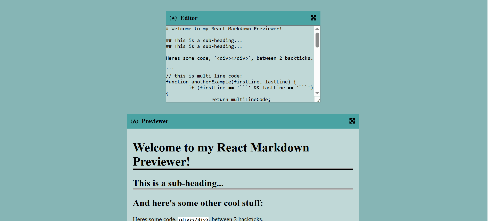

# 📝 Markdown Previewer
[Live Demo](https://bola-nabil.github.io/markdown-previewer/)

---
## 📖 Description
**Markdown Previewer** is an interactive web app that allows users to write text in Markdown and see the rendered HTML preview instantly.  
It’s a handy tool for experimenting with Markdown formatting, writing quick notes, or learning Markdown basics.

---
## 📸 Preview
  

---
## ✨ Features
- Real-time **Markdown editing and preview**
- Supports headings, links, lists, code blocks, images, blockquotes, etc.
- Responsive design — works well on desktop and mobile
- Clean, minimal, and lightweight interface
- Built to demonstrate **React state management and live rendering**

---
## 🛠️ Tech Stack
- **React** – UI and component rendering
- **JavaScript** – core logic
- **CSS3**– styling and layout
- **HTML5** – structure

---
## 🚀 Getting Started
1. Clone the repository:
```
git clone git clone https://github.com/bola-nabil/markdown-previewer.git
```
2. Install dependencies
```
npm install
```
3. Start the development server:
```
npm start
```

---
## 👤 Author
**Bola Nabil** — Web Developer
